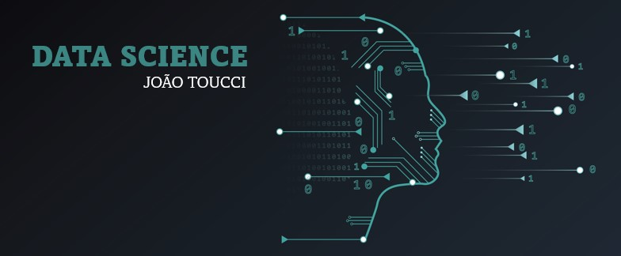

  

# João Toucci
*Data Analyst - Aspiring Data Scientist*

Data analyst in love for the data universe, where incredible things are possible throught computer and AI (machine learning and deep learning).
  I'm graduating in Data Science at Anhanguera (São Paulo University). I'm captivated by the field of science and data visualization, in which I have been studying for approximately a year, actively seeking an opportunity to further my career and personal growth in this domain.

**Background in:** Python, Power BI, SQL, Excel, Problem solving.

**Links:**
* [LinkedIn](https://www.linkedin.com/in/toucci/)
* [Kaggle](https://www.kaggle.com/toucci)
* [Hugging Face](https://huggingface.co/tooucci)

## Main projects:

* [**Reinforcement learning: Taxi game**](https://huggingface.co/tooucci/Taxi)
* [**Reinforcement learning: Playing Lunar Lander game**](https://huggingface.co/tooucci/lander_agent)
* [**Reinforcement learning: Other RL models**](https://huggingface.co/tooucci)
* [**Descriptive analysis of a IBGE data set**](https://github.com/Toucci/Trabalho-de-An-lise-Descritiva-de-um-Conjunto-de-Dados)
* [**Cleaning Data - SUS 2017**](https://www.kaggle.com/datasets/toucci/dados-sinan-animais-peonhentos-2017)
* [**Análise Picada de Peçonhentos em SP**](https://www.kaggle.com/code/toucci/an-lise-de-picadas-de-animais-em-sp)

## Python projects: 
* [**Practicing oriented object programming**](https://github.com/Toucci/Practicing-oriented-object-programming)
* [**Minsait - Final Activity**](https://github.com/Toucci/JoaoToucci_Minsait_)
* [**Minsait Activities**](https://github.com/Toucci/Minsait-JoaoToucci)
* [**Controlando inversor/motor com Python**](https://github.com/Toucci/opc_python)

---
